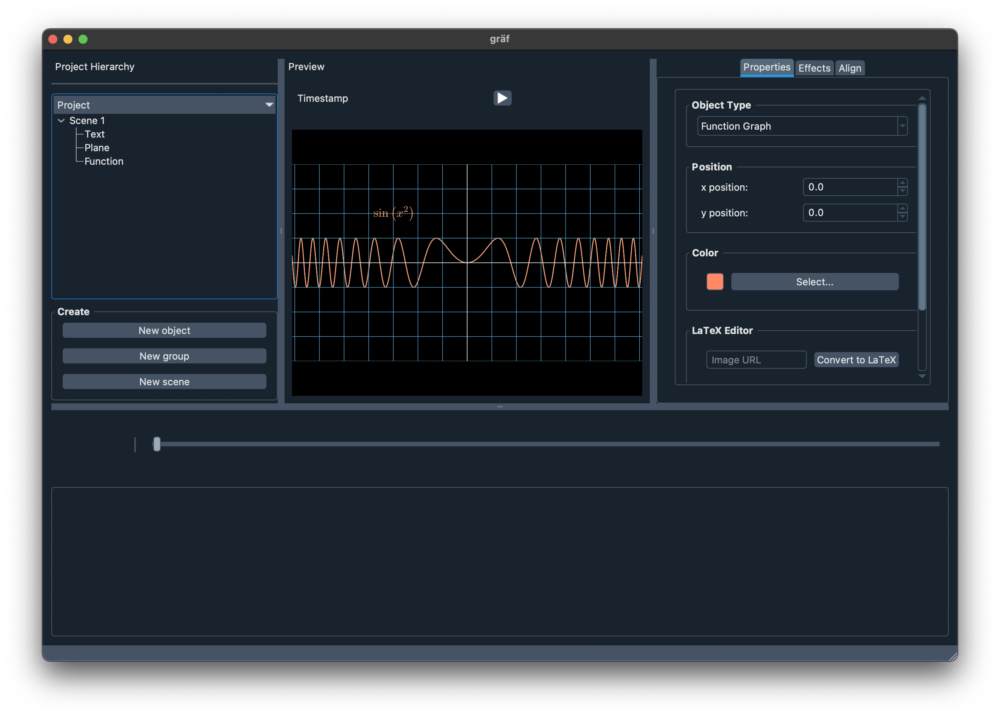

  

# gräf
GUI tool for making animations and graphics using the [manim](https://github.com/ManimCommunity/manim) animation engine. Used for easy use of the manim library and for a user-friendly interface for making math animations.

## Requirements
- [Python v3.10](https://www.python.org/downloads/release/python-3102/)
- [Latex2sympy2](https://pypi.org/project/latex2sympy/)
- [PyQt5](https://pypi.org/project/PyQt5/)
- [QDarkStyle](https://pypi.org/project/QDarkStyle/)
- [Requests](https://pypi.org/project/requests/)
- [SymPy](https://pypi.org/project/sympy/)

## Installation | Windows
- [Download](https://github.com/heyuncle/graf/archive/refs/heads/main.zip) the ZIP file and extract to target location.
- Run `pip install -r requirements.txt` in commandline or powershell.

## Installation | Ubuntu
- [Download] (https://github.com/heyuncle/graf/archive/refs/heads/main.zip) the ZIP file and extract to target location.
- Run `sudo apt-get install python3 python3-pip PyQt5`
- Install the pip packages with  `pip install latex2sympy2 PyQt5 QDarkStyle requests sympy`
- Install Manim
`sudo apt update
sudo apt install libcairo2-dev libpango1.0-dev ffmpeg`
`pip3 install manim`
- Install the GStreamer plugins with `sudo apt install ubuntu-restricted-extras`
- Pray to God it works! (It won't) 🙏

## Usage
- Execute the `manim.pyw` file.
- *Don't Crash, Difficulty: Impossible*
## Demo

## Contributing
## License
